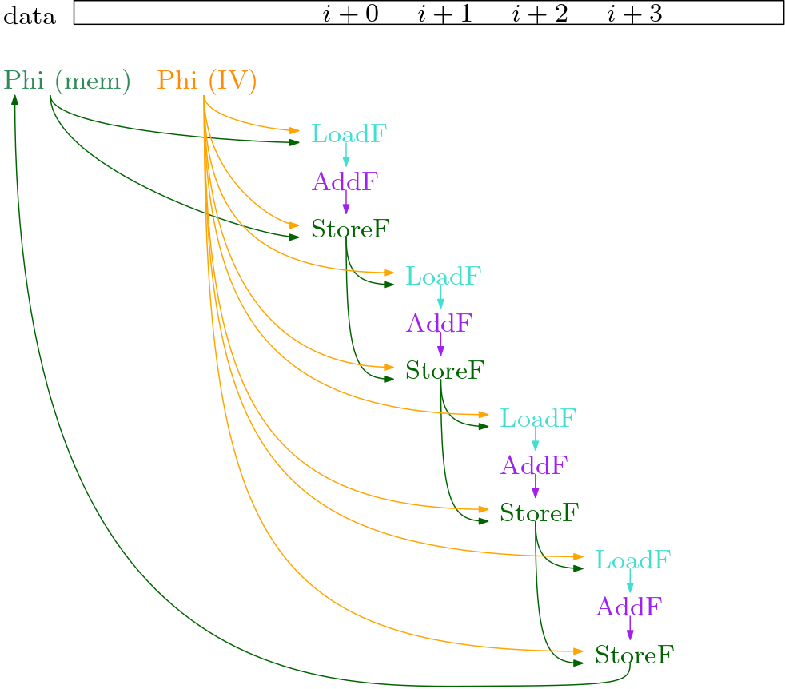
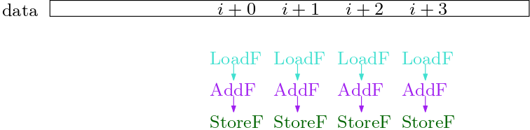
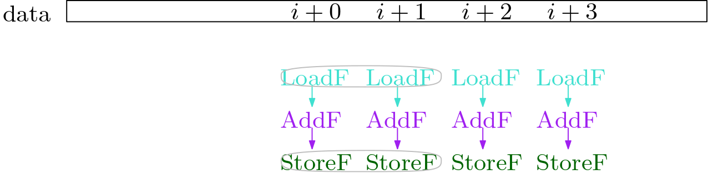
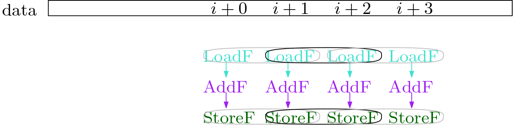
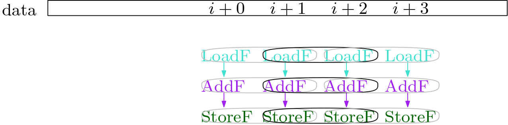
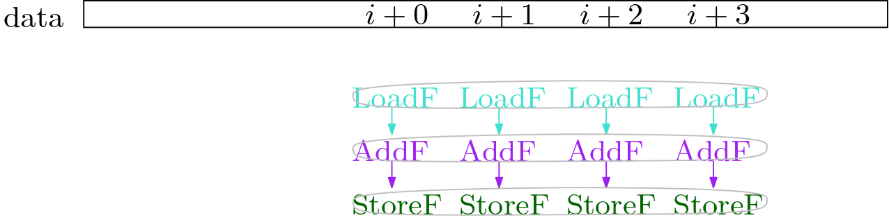
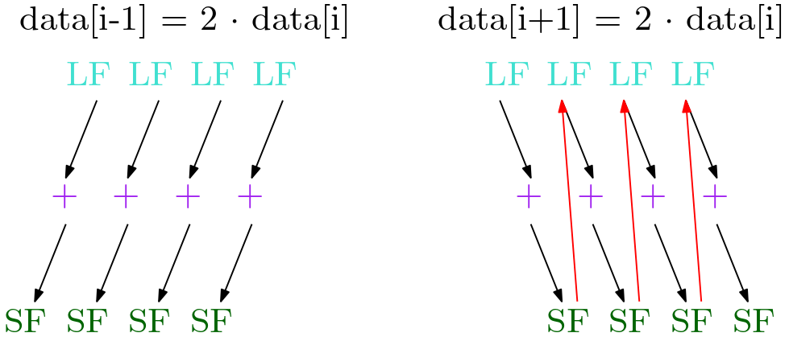

**Background: SIMD and Auto-Vectorization**

Modern CPU's have a variety of SIMD (single input multiple data) vector instructions (eg. intel's `SSE` and `AVX`, ARM's `NEON` and `SVE`). They make use of vector registers, which can hold multiple values of a type. For example a an `avx512` registers (512 bit) can hold 64 bytes, or 16 ints/floats, or 8 long/doubles. They can thus load, store, add, multiply, etc multiple values with a single instruction, but usually at the same cost (instructions per cycle, and latency) as with scalar (single) values.

It is thus beneficial to use SIMD instructions rather than their scalar equivalent. We can do this by hand.

```
    static void test(float[] data) {
        for (int j = 0; j < N; j++) {
            data[j] = 2 * data[j]; // ------------ scalar
        }
    }
    static void test_unrolled(float[] data) {
        // Pre loop
        for (int j = 0; j < N; j+=4) { // increment by 4 elements at a time
            data[j + 0] = 2 * data[j + 0];
            data[j + 1] = 2 * data[j + 1];
            data[j + 2] = 2 * data[j + 2];
            data[j + 3] = 2 * data[j + 3];
        }
        // Post loop
    }
    static void test_vectorized(float[] data) {
        // Pre loop
        for (int j = 0; j < N; j+=4) { // increment by 4 elements at a time
            vector_4floats v1 = load_4floats(data, i);
            vector_4floats v2 = multiply_4floats(const_4floats(2), v1); // 4 parallel multiplications
            store_4floats(data, i, v2);
        }
        // Post loop
    }
```

I am not going into the details of Pre-Main-Post loops (Pre-loop ensures we the Main-loop is memory-aligned, the Post-loop executes the few iterations left over after the Main-loop).

While we can do this work by hand, we do not want to do that. For one it is a lot of programming effort. Second, the vector length depends on the concrete CPU features, so one would have to have different vectorized code for each CPU. Hence, we want to have an algorithm in the compiler that does that work for us. It is supposed to detect where SIMD parallelization is possible, and decide if it is beneficial for performance. The primary concern is usually loops, where often most of the time is spent. But in principle one could speed up any part of a program that has enough parallelism.

**The SuperWord Paper**

In 2000, Samuel Larsen and Saman Amarasinghe presented [Exploiting Superword Level Parallelism with Multimedia Instruction Sets](https://groups.csail.mit.edu/cag/slp/SLP-PLDI-2000.pdf). They **auto-vectorize basic blocks**, so that multiple scalar operations can be packed into a SIMD vector instruction. Their algorithm can thus be used on any program part that does not contain control flow (no branching / merging, no If, etc). The only requirement is that it has sufficient parallelism. For loops, this can often be acheived by **loop unrolling**. That way, one can fuse together multiple loop iterations into one basic block, and exploit the potential parallelism between different loop iterations.

The algorithm has been **implemented in the Hotspot JVM**. However, there are a few things that have been altered for the implementation. It only applies the algorithm to loop bodies, after a few iterations of loop untolling.

**First Example**

Let's look at a simple Java example (`Test.java`):
```
public class Test {
    static int N = 100;

    public static void main(String[] strArr) {
        float[] data0 = new float[N];
        for (int i = 0; i < 10_000; i++){
            init(data0);
            test(data0);
        }
    }

    static void test(float[] data) {
        for (int j = 0; j < N; j++) {
            data[j] = 2 * data[j]; // ------- this is vectorized
        }
    }

    static void init(float[] data) {
        for (int j = 0; j < N; j++) {
            data[j] = j;
        }
    }
}
```

Execute it like this (with a debug build), and you should see that `SuperWord` was performed, among many other loop optimizations:
```
./java -XX:CompileCommand=printcompilation,Test::test -XX:CompileCommand=compileonly,Test::test -Xbatch -XX:+TraceLoopOpts Test.java
```

Run this to see more details about the SuperWord algorithm, and its steps:
```
./java -XX:CompileCommand=printcompilation,Test::test -XX:CompileCommand=compileonly,Test::test -Xbatch -XX:+TraceSuperWord Test.java
```

I ran it with this command, and recorded it with `rr`:
```
// -XX:LoopMaxUnroll=5 limits the unrolling factor to 4x.
rr ./java -XX:CompileCommand=printcompilation,Test::test -XX:CompileCommand=compileonly,Test::test -Xbatch -XX:+TraceSuperWord -XX:+TraceLoopOpts -XX:LoopMaxUnroll=5 Test.java
rr replay

// Set breakpoint before SuperWord is applied:
(rr) b SuperWord::SLP_extract

// Extract all nodes of the loop before SuperWord is applied:
(rr) p lpt()->_head->dump_bfs(1000,lpt()->_head, "#A+$")

// Run SuperWord:
(rr) finish

// Extract all nodes of loop after SuperWord:
(rr) p cl->dump_bfs(1000,cl, "#A+$")
```

The two dumps I visualize nicely:


One can see that the scalar operations were replaced with their vector equivalent:
```
LoadF -> LoadVector
AddF -> AddVF // Note: "2 * x" was replaced by "x + x"
StoreF -> StoreVector
```

**Basic Ideas for the Algorithm**

We will look at the basic ideas of the algirithm on the same example loop, which we unroll twice (`4x` unrolled).
```
for (int j = 0; j < N; j++) { data[i] = 2 * data[i]; }
```

I simplified the graph a little, but in essence the C2 graph looks like this:



We see the two `Phi` nodes: one holds the `i` (IV: induction variable), the other holds the memory state. I aligned all load, add and store operations with the respective offset in the `data` array. We can see that all the load and store operations here are on the same memory slice, of the float array `data`.

So far, we cannot see the parallelism in the graph. The `LoadF` of iteration `i+2` depends on the `StoreI` of iteration `i+1`. But we can prove that they do not access the same position in memory. Hence, we perform a dependency analysis, that gives us an improved dependency graph. In it, we ignore dependencies between loads and stores that do not access the same position in memory. In our example, we can remove all dependencies between the loop iterations.



Now, we see the parallelism in the dependency graph, that was apparent to the human eye when looking at the original Java code.

At this point, a few **definitions** and a more precise **problem statement** are due:

`DAG`: a `DAG` is a directed acyclic graph.

`Given`: the `DAG` with ops of a basic block (loop body, no control flow).

`Goal`: patch the `DAG` such that the scalar ops are packed into SIMD instructions. The new `DAG` must preserve the behavior of the old `DAG`.

`isomorphic`: to pack scalar ops into a single SIMD instruction, they must be similar (to simplicy: same `Opcode` and `velt_type`).

`independent`: two ops are `independent` if there is no path from one to the other. We can only pack independent ops into a SIMD vector, since they are executed concurrently, so one cannot use the other's output in any way.

`adjacent memory operations`: two memory operations that have a provable offset of exactly `sizeof(type)`. Two loads or two stores that are adjacent can thus potentially be packed into a single vector load or store.

At this point, we pack pairs of memory operations that are `adjacent`, `isomorphic` and `independent`.




Now we `extend` from the memory operations to the non-memory operations. We do this by starting at a pair that we already have, and checking if the pair has an input pair, or an output pair that matches (ie. is `isomorphic` and `independent`).



Once we have found all pairs, we can `combine` them into vectors, by stitching the pairs together: `[A, B] + [B, C] -> [A, B, C]`.



At this point, we need to do some sanity checks, and determine if vectorizing is indeed profitable.

Let's look at two other examples. In the first, we store "backward" (`i-1`), in the second we store "forward" (`i+1`). In the first, the loop iterations are `independent`, while in the second, we see that the `StoreF` from the previous iteration stores to the position that the next iteration's `LoadF` loads from. Such a depedency must be respected. Now, we see that the loads are `not independent`.



These are the basic ideas used in the algorith and implementation. It may seem simple now, but the complexity lies in the details.

**Algorithm Overview**

TODO: write

```
// Simplified from code:
bool SuperWord::SLP_extract() {
  // find memory slices
  // construct reverse postorder (rpo) list of block members
  // should we even vectorize? check if there is a store or reduction
  if (!construct_bb()) {return false;}
  
  // build dependence graph for each memory slice:
  // for every two memops in slice, check if they
  // are "!SWPointer::not_equal" (except Load -> Load)
  dependence_graph();
  
  // Propagate narrower integer type back when upper bits not needed.
  // Example: char a, b, c; a = b + c;
  // The AddI gets velt_type char.
  compute_vector_element_type();
  
  // initial Packset: find adjacent, isomorphic, independent pairs of memops
  // perform alignment analysis (currently under some construction/bugfixing)
  find_adjacent_refs();
  
  // extend PackSet from memops to non-memops pairs
  // follow use->def and def->use
  extend_packlist();
  
  // stitch pairs together: [a, b] + [b, c] -> [a, b, c]
  // split them into multiple if larger than max vector size
  combine_packs();
  
  // implemented? -> depends on hardware
  // profitable?  -> are all use and def in loop vectorizable?
  filter_packs();
  
  // hack the graph: replace the scalar ops with vector ops
  schedule();
}
```

**Algorithm Step 0: Loop Unrolling**

Unrolling: automatic or by hand

TODO: write

**Algorithm Step 1: Alignment Analysis**

TODO: write

**Algorithm Step 2: Identifying Adjacent Memory References (create pair PackSet)**

TODO: write

**Algorithm Step 3: Extend PackSet (to non memory nodes)**

TODO: write

**Algorithm Step 4: Combine PackSet (stitch the pairs together)**

TODO: write

**Algorithm Step 6: Filter Packset (implementable and profitable)**

TODO: write

**Algorithm Step 7: Schedule (patch the graph)**

TODO: write


**Appendix**

Open Tasks and Questions
